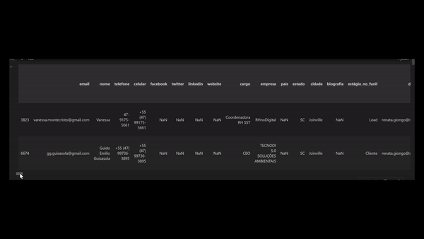
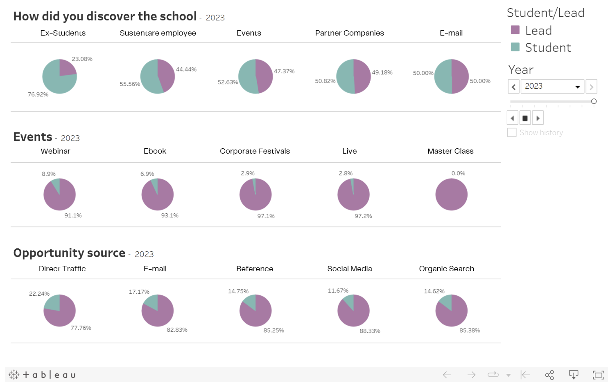

# Analysis of the funnel tunel for Sustenare Bussines School

## School
The Sustentare Business School is the higher education institution in the North region of Santa Catarina - Brazil that offers the largest number of specialization and MBA options. There are more than 60 postgraduate courses (Lato Sensu) in the areas of Management, Innovation, Finance, Marketing, Engineering, Information Technology, Operations, and Design. The institution also provides extension courses, training, in-company courses, and corporate programs.

## Objetive of the project
The goal of this project is to gain a comprehensive understanding of the sales funnel of Sustentare Business School. By delving into the intricacies of this funnel, we aim to identify strategic opportunities and take targeted actions to increase the conversion rates of leads into enrolled students.

## Deliveriables

#### **1. Profile Persona of Sustentare Students:**
    
To create a detailed profile persona that encapsulates the characteristics, preferences, and behaviors of Sustentare Business School's students.

This persona serves as a guiding light for crafting tailored marketing strategies that resonate with the target audience, ensuring our communication is not only relevant but also impactful.

#### 2. **Effective Actions for Conversion:**

To pinpoint and implement effective actions that facilitate the transition of leads (visitors) into enrolled students.

These identified actions are grounded in data analysis and are designed to optimize the sales funnel, creating a more seamless and compelling journey from initial interest to successful enrollment.

## Databases
The exploration of the sales funnel involved navigating through two distinct databases, each presenting its unique challenges and opportunities.

#### RD Station Database (Marketing Leads):

Derived from a CSV exported from RD Station, the marketing automation platform.

The database contains information on leads, some of whom are students, though the platform doesn't explicitly categorize them as such. Notably, some fields lacked a consistent pattern, requiring careful organization and understanding to extract meaningful insights. This was particularly evident in cases where multiple fields represented the same information, adding a layer of complexity to the data analysis process.

#### Unimestre SQL Database (Student Information):

Extracted from a SQL database based on the Unimestre platform, the school's CRM system.

Despite its richness in student details, the SQL database presented organizational challenges, featuring over 100 tables.

# Steps

1. Cleaning
2. Transforming
3. Machine Learning
4. Analyzing and Visualization

## Cleanning 

Addressing inconsistencies and improving the quality of the data. Correcting errors, handling missing values, and ensuring uniformity.

Importing data from RD Station CSV and extracting student information from Unimestre's SQL database.

The primary goal was to achieve clean and well-organized datasets, instrumental for subsequent analysis. Through extraction, searching, and null value filling, the following reductions were achieved:

- **First log student** by 75%
- **Job Title** by 13%
- **Course of Interest** by 8%
- **City** by 6%  

These reductions signify a substantial improvement in data quality, setting the stage for seamless dataset merging and insightful analysis.

## Transformating

Preparing the data for analysis and machine learning. Restructuring, combining, and enhancing datasets for better compatibility.

In this phase, the dataset underwent several manipulations to enhance structure and utility.

- Converted specified columns to datetime format
- Calculated the number of months since the first conversion, last convertion 
- Calculated the age based on the birthdate column, adding a new column to the DataFrame
- Added new columns for specific keywords, populating them with counts of occurrences 
- Added a new column 'total_eventos' that counts the number of values separated by "|" that represent the events that the person participated.

## Machine Learning 

Implementation of machine learning algorithms to discern the most influential features predicting whether a visitor transitions to becoming a student.

### Model Choice: XGBoost

#### Handling of Categorical Data & Treatment of Null Values

The model's exceptional proficiency in managing both categorical features and null values positions it as the optimal choice for the dataset analysis.

#### Model Performance
- **Accuracy:** 97.91%
- **Kappa Score:** 0.0894

## Analysis & Visualization

Leveraging insights gained from machine learning and additional information obtained during the transforming phase, a comprehensive analysis was conducted.
    
To enhance interpretability, graphics were plotted on Tableau, providing a visual narrative that allowed for a more accessible and insightful exploration of the data.

**Effective Actions:**

**Students’ Profile:**
](image/profile_student.png)

# Conclusion

After an in-depth exploration of the sales funnel and a thorough understanding of strategies to boost conversion rates, the analysis has yielded valuable insights.

### Effective Actions:
    After the a detailed investigation on the most influential features done with our machine learning model, a prominent factor influencing the decision to become a student is how the person discover the school.

The visualization in Tableau further reinforces this, revealing that recommendations from **Ex-Students** result in the **highest conversion rates.** An actionable recommendation is to incentivize and reward students who refer friends and family, fostering a culture of positive word-of-mouth marketing.

Additionally, our analysis indicates that master classes, while engaging, show minimal impact on conversion. **Redirecting efforts** towards more effective channels, such as **webinars**, could enhance overall conversion rates.

### Students’ Profile:
In crafting the profile persona, we identified a significant concentration in the **Human Resources sector.** This finding prompts strategic considerations for the school, such as **expanding** course offerings tailored to the needs of this specific sector. Simultaneously, evaluating the performance of courses in other areas may reveal insights into factors impacting their enrollment rates.

**Analyzing demographic** data revealed that the median age of the students are 34. Understanding where students predominantly work, where they pursued their university education, and their age distribution provides a foundation for targeted marketing campaigns. 

In conclusion, this project equips Sustentare Business School with actionable strategies to enhance its sales funnel and drive higher conversion rates. 

# Links
[Tableau Dashboard](https://public.tableau.com/app/profile/ana.cidral/viz/SustentareAnalysis/Story1?publish=yes)

[Apresentation](https://www.canva.com/design/DAF16QrcUyw/x9ZvktzEbKfIVQQvddZjSQ/edit?utm_content=DAF16QrcUyw&utm_campaign=designshare&utm_medium=link2&utm_source=sharebutton)